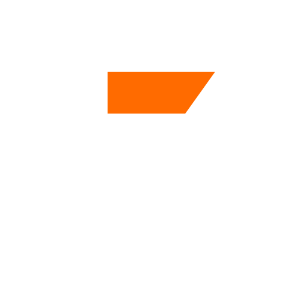

<p align="center">
  
</p>

<h1 align="center">Forge Agent for Claude Code</h1>

<p align="center">
  Workflow de desenvolvimento autônomo — planejamento, execução, verificação e git<br>
  gerenciado por agentes especializados com memória emergente.
</p>

<p align="center">
  Baseado na metodologia <a href="https://github.com/gsd-build/gsd-2">GSD-2</a> (MIT) — reimplementado para o sistema nativo de agentes do Claude Code.
</p>

---

## O que você ganha

- Hierarquia **Milestone → Slice → Task** com contexto fresco por unidade
- Agentes especializados por fase (Opus para pensar, Sonnet para executar)
- Memória emergente — o sistema aprende padrões e gotchas do seu projeto
- Git automático — branch por slice, squash merge, commits semânticos
- Tudo em arquivos `.md` — recuperável após crash, auditável, versionável

---

## Quick start

```bash
git clone https://github.com/<seu-usuario>/forge-agent
cd forge-agent
bash install.sh            # macOS/Linux
# .\install.ps1            # Windows
```

```bash
cd /seu/projeto
claude
```

```
/forge-init minha plataforma de e-commerce com Next.js
/forge-new-milestone autenticação de usuários com NextAuth
/forge
```

O `/forge` é o shell interativo principal — navega entre milestones, executa unidades e responde perguntas sem sair do REPL.

Verificar instalação: `/forge-help`

---

## Arquitetura v1.0 — 3 comandos + skills

A partir da v1.0, o Forge Agent usa **3 comandos slash** e **skills** para tudo o mais:

| Tipo | Exemplos | Como invocar |
|------|---------|--------------|
| Comando slash | `/forge`, `/forge-init`, `/forge-update` | Digitar `/` no Claude Code |
| Skill | `forge-auto`, `forge-status`, `forge-new-milestone`... | Via `/forge` REPL ou digitando o nome |

### Comandos slash

| Comando | O que faz |
|---------|-----------|
| `/forge` | **Entry point principal** — REPL interativo com menu: auto, task, new-milestone, status, help |
| `/forge-init [descrição]` | Inicializa o projeto GSD — cria `CLAUDE.md` + `.gsd/` + prefs |
| `/forge-update [caminho]` | Atualiza Forge Agent (git pull + reinstala). Preserva preferências. |

### Skills de execução e planejamento

| Skill | O que faz |
|-------|-----------|
| `forge-auto` | Executa o milestone inteiro de forma autônoma até concluir |
| `forge-next` | Executa exatamente uma unidade e para (step mode) |
| `forge-task <descrição>` | Task autônoma sem milestone — brainstorm → discuss → plan → execute |
| `forge-new-milestone <descrição>` | Cria milestone completo — brainstorm → scope → discuss → ROADMAP |
| `forge-discuss <milestone\|S##>` | Abre fase de discuss para milestone ou slice |
| `forge-add-slice`, `forge-add-task` | Adiciona slice ou task a um milestone existente |

### Skills de visibilidade e manutenção

| Skill | O que faz |
|-------|-----------|
| `forge-status` | Dashboard de progresso — milestone, slices, próxima ação |
| `forge-doctor [--fix]` | Diagnóstico do projeto — valida e corrige STATE, arquivos, prefs |
| `forge-codebase [--fix]` | Qualidade do codebase — lint, nomenclatura, estrutura |
| `forge-sweep [--apply]` | Limpa know-how (AUTO-MEMORY, DECISIONS, milestones, sessões) — dry-run por padrão |
| `forge-explain <alvo>` | Explica qualquer artefato GSD sem modificar nada |
| `forge-memories` | Gerencia memórias auto-aprendidas do projeto |
| `forge-ask` | Modo conversa — discute ideias, captura decisões |
| `forge-prefs` | Configuração de modelos por fase e git settings |
| `forge-config`, `forge-mcps` | Status line, hooks e MCPs |
| `forge-help` | Ajuda completa |

### Skills de qualidade (invocadas automaticamente ou manualmente)

| Skill | O que faz |
|-------|-----------|
| `forge-brainstorm` | Explora alternativas e riscos antes de planejar |
| `forge-scope-clarity` | Contrato de escopo com critérios testáveis |
| `forge-risk-radar` | Análise de riscos por slice (auto-invocada em slices `risk:high`) |
| `forge-security` | Checklist de segurança por task (auto-invocada por keywords) |
| `forge-responsive` | Audit responsivo — Core Web Vitals, WCAG 2.2 |
| `forge-ui-review` | Review UI — acessibilidade, performance, React 19 |

> **Compatibilidade retroativa:** IDs legados no formato `M###` (ex.: `M006`) e `TASK-###` continuam sendo lidos e resolvidos normalmente — `--resume`, `/forge-explain` e `/forge-discuss` aceitam ambos os formatos. Novos milestones e tasks soltas criados pelo forge geram IDs no formato timestamp `M-<ts>-<slug>` / `T-<ts>-<slug>` (ex.: `M-20260522101500-pagamentos`).

---

## Fragment store + projection

Forge Agent stores `.gsd/` knowledge (ledger, decisions, auto-memory) as **per-unit fragments**
instead of mutable monolith files — one small file per milestone, session, or task.

Three stores live under `.gsd/`:

| Store | Path | Contents |
|-------|------|----------|
| Ledger | `.gsd/ledger/<id>.md` | Compact record of each completed milestone |
| Decisions | `.gsd/decisions/<id>.md` | Architecture decisions scoped to a unit |
| Memory | `.gsd/memory/<id>.md` | Auto-learned patterns from completed work |

The familiar monolith files (`LEDGER.md`, `DECISIONS.md`, `AUTO-MEMORY.md`) are **projection
cache** — rebuilt on-read by [`scripts/forge-projection.js`](scripts/forge-projection.js) and
excluded from version control (`.gitignore`/`svn:ignore`). This makes the stores
conflict-free by construction: each fragment has exactly one owner (one unit of work, one
developer, one branch).

Migration from the pre-M001 monolith layout runs automatically during `/forge-update` and
keeps a `.bak` copy of every monolith until you verify the projection matches.

For full details — layout, fragment schema, projection engine, migration, and doctor checks —
see [docs/fragment-store.md](docs/fragment-store.md).

---

## Documentação

| Doc | Conteúdo |
|-----|----------|
| [Arquitetura](docs/architecture.md) | Fluxo de execução, agentes, modelos, memória emergente |
| [Comandos](docs/commands.md) | Referência completa de todos os comandos |
| [Skills](docs/skills.md) | Skills incluídas, como instalar e contribuir |
| [Configuração](docs/configuration.md) | Preferências, status line, arquivos do projeto |

> **Nota — `review.engine: workflow` e approval prompt:** quando `review.engine: workflow` está configurado, cada debate de review usa a tool `Workflow` do Claude Code (requer ≥ v2.1.154). Em `permissions.defaultMode` padrão, **cada invocação Workflow pede aprovação do operador** — o que pausa o `forge-auto` silenciosamente. Para uso autônomo, configure `permissions.defaultMode: bypassPermissions` (usuários com a statusline ativa já têm — ativado pelo `merge-settings.js`). Se a tool `Workflow` não estiver disponível ou a invocação falhar, o gate faz **fallback automático para `engine: agents`** com um warning e regista o evento `review-engine-fallback` — nunca bloqueia.

> **Pré-requisito — `review.challenger: codex`:** o challenger Codex requer o [Codex CLI](https://github.com/openai/codex) (`codex`) instalado e autenticado, por um destes dois caminhos:
>
> - **Login por assinatura ChatGPT** (recomendado): `codex login` — abre um fluxo de browser, credencial gerenciada pelo próprio CLI.
> - **`OPENAI_API_KEY`** no ambiente: exporte a variável de uma fonte segura (`.env` gitignored ou secret manager) — **nunca** hardcoded em prefs commitáveis (`.gsd/claude-agent-prefs.md` é versionado; uma chave ali seria vazamento).
>
> O forge **não instala nem autentica** tooling de terceiros — apenas invoca o `codex` já configurado pelo usuário via `scripts/forge-xllm.js`, que nunca recebe a credencial por argumento (a auth é gerenciada inteiramente pelo próprio CLI). Sem `codex` disponível, o gate faz **fallback automático para `forge-reviewer` (Claude)** com o evento `review-challenger-fallback` — nunca bloqueia. Implicação de privacidade: com `challenger: codex`, o diff do slice sai da máquina local para a API da OpenAI.

> **Pré-requisito — `review.challenger: gemini`:** o challenger Gemini requer o [Antigravity CLI](https://antigravity.google) (`agy`) instalado e autenticado, por um destes dois caminhos:
>
> - **Login no Antigravity** (recomendado): faça login uma vez (IDE ou CLI) — em headless o `agy` usa a auth silenciosa por keyring, com refresh automático de token.
> - **`GEMINI_API_KEY`** (ou `ANTIGRAVITY_API_KEY`) no ambiente: exporte de uma fonte segura (`.env` gitignored ou secret manager) — **nunca** hardcoded em prefs commitáveis.
>
> O modelo é opcional: `challenger_model` aceita um **label** do `agy models` (pode conter espaços — use aspas: `"Gemini 3.1 Pro (High)"`); unset usa o default do CLI. O adapter invoca `agy --print` com `--sandbox` (restrições de terminal) e o mesmo contrato do codex: sem `agy` disponível (binário, auth, quota, rede, stdout vazio), **fallback automático para `forge-reviewer` (Claude)** com o evento `review-challenger-fallback` (`gemini-exit-nonzero`) — nunca bloqueia. Implicação de privacidade: com `challenger: gemini`, o diff do slice sai da máquina local para a API do Google.

---

## Atualizar

```bash
cd forge-agent
git pull
bash install.sh --update
```

Preferências e arquivos de projeto nunca são sobrescritos.

---

## Créditos

Reimplementação dos conceitos do **[GSD-2 (gsd-pi)](https://github.com/gsd-build/gsd-2)** para o sistema nativo de agentes do Claude Code. Hierarquia Milestone → Slice → Task, contexto fresco por unidade, memória emergente, workflow de fases e git branch-per-slice são designs originários do gsd-2.

Este repositório não distribui nem modifica código do gsd-2 — apenas reimplementa os conceitos usando arquivos `.md`.

## Licença

MIT — veja [LICENSE](LICENSE)
